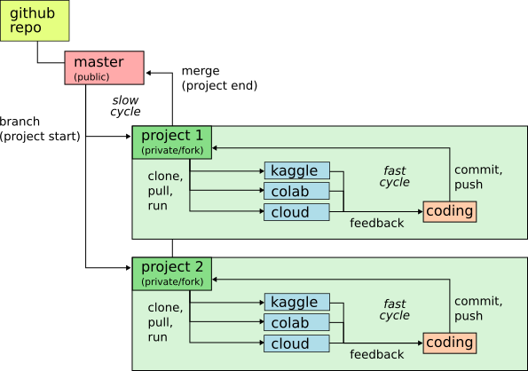

--------------------------------------------------------------------------------

DeepTrane🎷 is a project-oriented deep learning library. Its main goals are:
- Provide training setups/pipelines for PyTorch, TensorFlow, YOLOv5
- Quickly setup new projects in custom modules
- Fast dev cycle with remote execution (cloud/kaggle/colab) and full version control
- Easily merge project code into master branch
- Flexible experiment configuration



<details open>
	<summary>Install</summary>

```bash
git clone https://github.com/yellowdolphin/deeptrane  # clone
cd deeptrane
python train.py  # pytorch test run
```

</details>

<details open>
	<summary>Quick Start</summary>

	To start a new project, [fork](https://docs.github.com/en/get-started/quickstart/fork-a-repo) the repo and create a new branch.

```bash
git clone https://github.com/[user_name]/deeptrane
cd deeptrane
git checkout -b [my_project]  # create new branch for you project
git push origin [my_project]  # push the branch to your github fork
```

	Custom code and global settings for the project should be defined in `projects/[my_project].py`, whereas experiments can be configured in `configs/[experiment_name].py`. The default configuration is `projects/defaults.py`. Call the training script with option `-c [experiment_name]` to update the config for your experiment. In the API, it is passed as a `cfg` namespace object. Your learning rate, for instance, will be `cfg.lr`.

```bash
python train.py    -c [experiment_name]  # PyTorch or YOLOv5
python train_tf.py -c [experiment_name]  # Tensorflow
```

### The project module

As minimal example, let's train an image classifier for the [Cassava Leaf Disease](https://www.kaggle.com/competitions/cassava-leaf-disease-classification) kaggle competition using PyTorch. Project settings are specified in function `init(cfg)` in projects.cassava:

```python
from pathlib import Path

def init(cfg):
    cfg.competition_path = Path('/kaggle/input/cassava-leaf-disease-classification')

    if cfg.filetype == 'jpg':
        assert cfg.size[0] == cfg.size[1]
        size = cfg.size[0]
        cfg.image_root = Path(f'/kaggle/input/cassava-jpeg-{size}x{size}/kaggle/train_images_jpeg')

    cfg.meta_csv = cfg.competition_path / 'train.csv'
```

Scaled input images are read as JPEGs from `cfg.image_root`. This path to a kaggle dataset will depend on the image size specified in the config file. 

Labels are read from the official competition dataset and stored in a pandas DataFrame. The API expects classifier labels in column `category_id`. If present, it calls `project.add_category_id(df, cfg)` to generate them:

```python
def add_category_id(df, cfg):
    return df.rename(columns={'label': 'category_id'})

```

The image path associated with the label will be 

```python 
f"{cfg.image_root}/{image_id}.{cfg.filetype}"
```

Where `image_id` is another column of the DataFrame and if present, the API calls `project.add_image_id(df, cfg)` to create it:

```python 
def add_image_id(df, cfg):
    df['image_id'] = df.image_id.str.split('.').str[0]
    return df
```

Augmentation, model, and training details are specified in the config file `configs/cassava_resnet18_v001.py`. This [kaggle notebook](https://www.kaggle.com/code/greendolphin/cassava-deeptrane) shows how to run the experiment and evaluate the training metrics.

### PyTorch training


</details>
